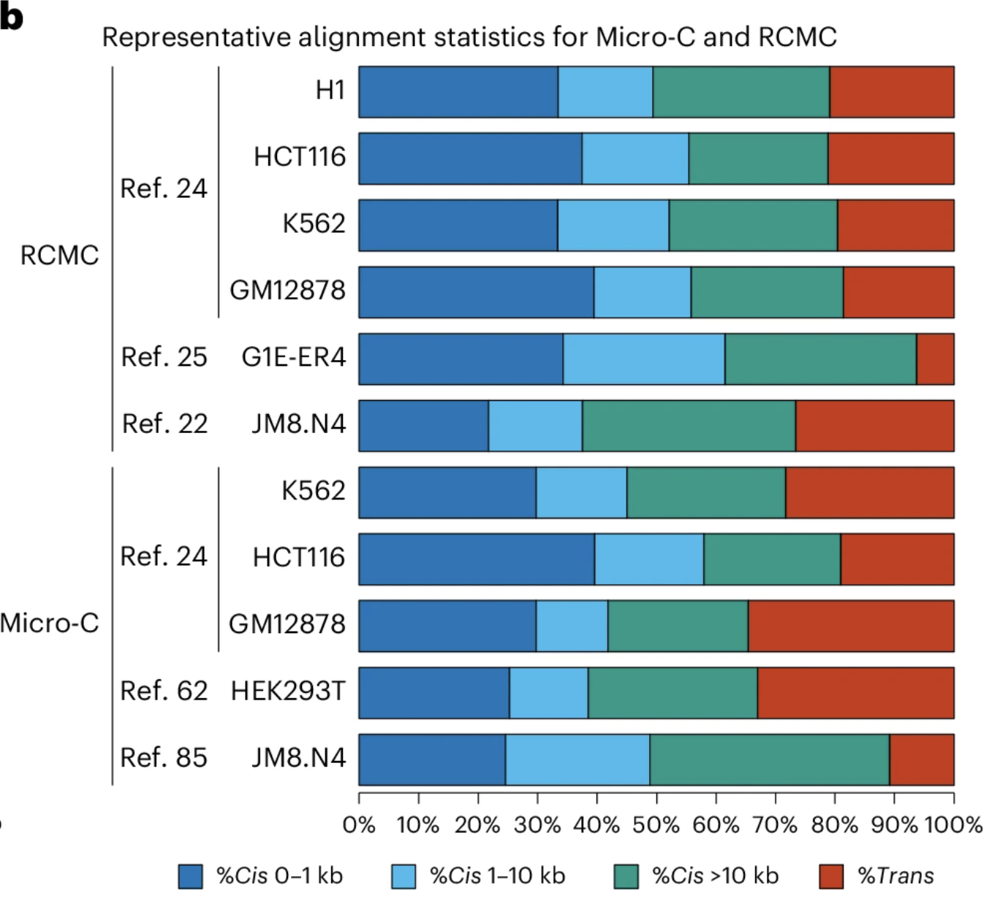

# 1. Quickstart

## Understanding your dataset: read depth, informative reads, and resolution

# A brief summary of Micro-C processing and outputs

First, I will give a broad overview of how the data was processed, since it's easy to run a pipeline without understanding what went into it. In our pipeline (Resources:pipeline for Micro-C and RCMC), we use a standard sequencing aligner (bwa-mem2) with some extra flags to account for differences between typical paired-end libraries and Micro-C libraries. Then, we use pairtools to find read pairs where both ends aligned properly and where the read is unique. Finally, we store these uniquely mapped pairs in a .cool file, which allows us to store and access pairs efficiently. 

Since 3D genomics has low coverage compared to typical methods, we usually need to bin pairs from nearby genomic positions together to visualize and analyze data. People often refer to the size of the bin (how many genomic positions are pooled together into one bin) as "resolution," but it's hard to define resolution in the 3D genomics context. So, I will refer to this term as "binsize," and reserve "resolution" for metrics that actually measure the richness or quality of the dataset (more detail below). 

The main file format that we will be working with is called an .mcool file, which stores coolers binned at multiple binsizes together simultaneously. At each binsize, the cooler is "balanced" to account for systematic differences that could affect read counts, such as accessibility biases. Typically, our .mcools contain binsizes from 250bp to 10Mb. The cooler package is extremely well-documented (see Resources:cooler documentation page). If you are not familiar with how to load a cooler (`cooler.Cooler()`) or fetch a matrix (`matrix.fetch())`) it may be worth taking some time to read about how to do that, although I will talk about matrices more later.

# Reporting the quality of your data

Often, the first thing you want to do after processing your data is see how good it is. The quickest and most informative way is to look at the `stats` output of `pairtools dedup`, which is the command that finds and removes duplicate pairs that were marked by `pairtools parse2` (see [pairtools docs](https://pairtools.readthedocs.io/en/latest/index.html) for more information. 

First, let's grab the quantities of interest from the stats file into a python dataframe:

```
def grab_metrics(statfile, *args):
    with open(statfile, 'r') as f:
        stats = [line.rsplit('\t', 1) for line in f]
        stats_dict = {
            key: int(value) / 1_000_000_000
            for key, value in stats
            if key in args
        }

    return os.path.basename(statfile).split('.')[0], stats_dict

metric_args = ['total', 'total_mapped','total_unmapped','total_nodups', 'total_dups', 'cis','trans', 'cis_1kb+', 'cis_20kb+']
metrics = [grab_metrics(statfile, *metric_args) for statfile in stat_files]

metric_df = pd.DataFrame.from_dict(dict(metrics), orient='index')

```

Why do we care about these quantities?
1. `total_dups` / `total_mapped` represents your duplicate fraction. Numbers >50% indicate that most of your reads were either sequencing (optical) duplicates, or PCR duplicates, which could be due to over-sequencing your library or reflect a low-complexity library.
2. `total_nodups` represents the number of uniquely mapped reads, which is the quantity that actually goes into the processed data and therefore represents the quantity of downstream analyzable reads.
3. the `cis` and `trans` ratios can be informative of your digestion and crosslinking, which is out of the scope of this tutorial to explain in detail, but in general we want a cis fraction of 60% at minimum.
4. `cis_1kb+` represents the number of "informative" reads, since very close pairs (<1kb) are not informative for 3D genomic analyses. If most of your reads are <1kb, the data may not be of analyzable quality.

There is no absolute metric for evaluating these numbers. However, for helpful context, here are the `pairtools stats` metrics for several Micro-C and RCMC generated by the Hansen Lab. 



Lastly, I'll touch on the concept of "resolution." In optics, resolution is the minimum distance between two emitters such that they can be resolved as distinct. Generally, it refers to the "clarity" of an image. In 3D genomics, [Rao et al (2014)](https://pmc.ncbi.nlm.nih.gov/articles/PMC5635824/) define contact map resolution as the smallest binsize where 80% of the bins have >=1000 counts. This gets at the same idea as image resolution -- if 1000 counts per bin indicates sufficient signal to resolve different features, then the smaller binsize that achieves this number, the smaller distance between the features you can resolve. Here is a code snippet (originally by Clarice Hong) to calculate it. Note that at these small binsizes, there will be exceedingly large memory requirements to load the cooler matrix for large regions, so I used a small test region. 

```
# add more to this list for a more precise estimate 
resolutions = [150, 200, 250, 500 , 1000, 5000, 10000]

# 1Mb test region
test_region = 'chr2:1_000_000-2_000_000'

clr_name = YOUR_COOLER_NAME

bin_proportions = {}
for res in resolutions:
    clr = cooler.Cooler(f'{clr_name}::resolutions/{res}')

	# get cooler matrix at the current binsize
	mat = clr.matrix(balance=False).fetch()

	all_bins = []
	for row in mat:
		 all_bins.append(sum(row)) # total counts per bin

	# bins that satisfy the count requirement
	filled_counts = [i for i in all_bins if i > 1000]

	# fraction of all bins that satisfy the count requirement
	bin_proportion = len(filled_counts)/len(all_bins)
	bin_proportions[res] = bin_proportion

print(bin_proportions) # your resolution is the smallest binsize where bin_proportion >= 0.8

```

Of course, at some arbitrarily large binsize, any contact map would have 80% of its bins have 1000 counts, unless your sequencing yielded less than 1000 valid pairs genome-wide (ouch). However, the more you bin reads together, the more you obscure more focal (punctate) interactions. CREs interacting without CTCF, in particular in micro-compartments, are very difficult to see at >2kb binsize and above. But if your map does not have enough counts per bin at the small binsizes, you won't be able to see those interactions anyway. This underscores why we care about resolution. 

Unfortunately, there is no golden rule for how many reads you need to achieve a certain resolution. It depends on the chromatin you're working with, the way you do the protocol, your sequencing parameters, and more. In general, we can comfortably distinguish CRE contacts in Micro-C at around 5 billion uniquely mapped reads. 

## Visualization with Hi-Glass:

Hi-Glass is a web viewer that supports 3D genomics datasets in addition to 1D tracks. Please follow the "visualization" section of the [Micro-C/RCMC paper](https://www.nature.com/articles/s41596-026-01393-3) to set up a docker instance. (@Hansen Lab, we have a shared instance running. Please see the private docs for instructions.)

We often want to use 1D tracks like .bigwig and .bed files to view alongside our 3D genomics. To add 1D tracks, we use a package called [`clodius`](https://pypi.org/project/clodius/) to aggregate datasets in a zoom-able way, since they are not inherently multi-binsize like .mcools. There is detailed information of how to load various datasets on the [Hi-Glass page](https://pkerpedjiev.github.io/higlass-docs-beta/data_preparation.html) but here are some snippets:

```
#!/bin/bash

# remember to define all your variables
chromsizes_path = /PATH/TO/CHROMSIZES/
proj_name = YOUR_PROJECT_NAME # helps organize sub-folders in Hi-Glass
assembly = YOUR_ASSEMBLY # ex. hg38

## bedpe file, ex. loops:
clodius aggregate bedpe --chromsizes-filename "${chromsizes_path}" "$LOOPFILE_BASENAME.bedpe" --output-file "LOOPFILE_BASENAME.multires"
higlass-manage ingest "${loop_file_basename}.multires" \
	--filetype bed2ddb \
	--datatype 2d-rectangle-domains \
  --project-name "${proj_name}"

#bw
higlass-manage ingest BIGWIG_FILENAME --assembly "${assembly}" --project-name "${proj_name}"

## bed:
clodius aggregate bedfile --chromsizes-filename "${chromsizes_path}" BEDFILE_BASENAME.bed
higlass-manage ingest --project-name "${proj_name}" BEDFILE_BASENAME.bed.beddb

```

If you have Hi-Glass running on a server (@Hansen Lab, this applies to our shared instance; see private docs) then be sure to move the aggregated files to the media directory (where all the files are stored) before you run `ingest`, and add the flag `--no-upload` to your `ingest` command. 

## Resources:

- [Mapping pipeline for Micro-C and RCMC](https://github.com/ahansenlab/MicroC_RCMC_analysis/) 
- [cooler documentation page](https://cooler.readthedocs.io) 
- [pairtools explanation of pair types](https://pairtools.readthedocs.io/en/latest/formats.html) 


---

**Next:** [P(s) curves and observed-over-expected](expected.md)
